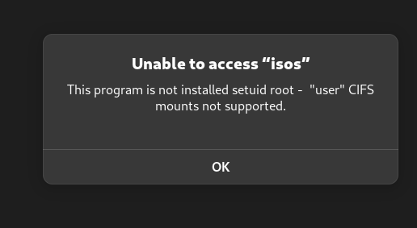

# Adding/Mounting Shared Drives(via SMB) to Ubuntu / Fedora
Distilled from the source listed below for my specific needs (protected access folders)
## FSTab Method
### Install CIFS Utils package

Ubuntu: `sudo apt-get install cifs-utils`
Fedora: `sudo dnf install cifs-utils`

### Create mount directories

For each folder you want to mount, create the mount folder

`sudo mkdir /media/sharedfolder`

### Create a credentials file

#### Open new file in editor
`nano ~/.smbcredentials`

#### Add username and password
```
username=myunraidusername
password=myunraiduserpassword
```
#### Save
`Ctrl`+`o`

#### Exit editor
`Ctrl` + `x`

#### Change permissions
`chmod 600 ~/.smbcredentials`

### Add settings to fstab file

#### Open fstab file with root
`sudo nano /etc/fstab` 

#### Add entry
`//tower.local/sharename /media/sharedfolder cifs uid=linuxusername,credentials=/home/ubuntuusername/.smbcredentials 0 0`
(change to selected server name or put in IP address)

#### Save
`Ctrl`+`o`

#### Exit editor
`Ctrl` + `x`

### Mount folder
`sudo mount /media/sharedfolder`

or to mount all folders at once:

`sudo mount -a`

### To unmount via shell
`sudo umount /media/sharedfolder` 

** Might get this on Fedora:

```
mount: (hint) your fstab has been modified, but systemd still uses
       the old version; use 'systemctl daemon-reload' to reload.

```

### Troubleshooting "User CIFS Not Supported" error
If you encounter this error:
<p align="center"></p>

Change the following settings:

```
sudo chmod u+s /bin/mount
sudo chmod u+s /bin/umount
sudo chmod u+s /usr/sbin/mount.cifs
```


#### ** You can mount unprotected (guest) folders via the original guide below(not applicable if you have hardened your samba settings)

## SystemD Method


Source of notes: 
* [Mounting CIFS Shares Permanently](https://ubuntu.com/server/docs/how-to-mount-cifs-shares-permanently)
* ["user" CIFS mounts not supported error](https://discussion.fedoraproject.org/t/suddenly-user-cifs-mounts-not-supported/78652)
* [Systemd Mount](https://discussion.fedoraproject.org/t/suddenly-user-cifs-mounts-not-supported/78652/11)

