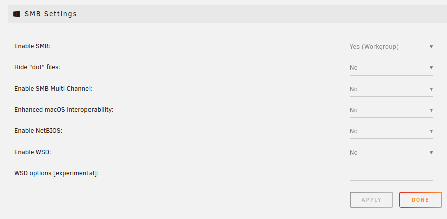
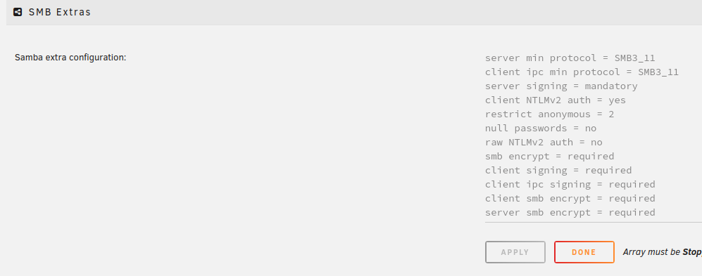
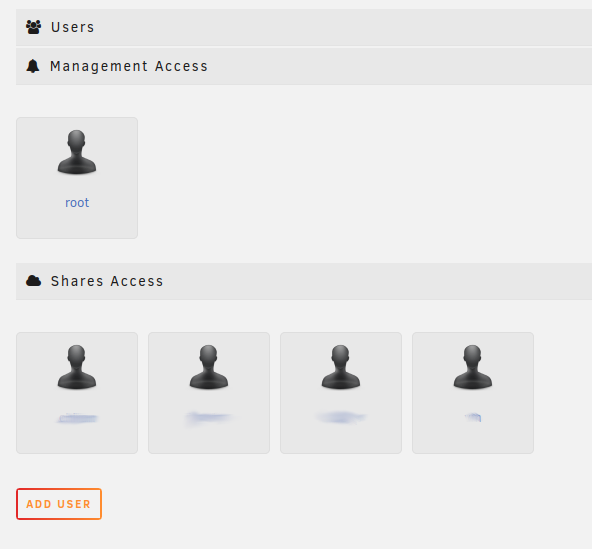

# Unraid shares hardening

## Disable unused protocols
Disable NFS, FTP server if not used

# Disable NetBIOS and WSD
<p align="center"></p>


# Add Samba extra config

```
server min protocol = SMB3_11
client ipc min protocol = SMB3_11
server signing = mandatory
client NTLMv2 auth = yes
restrict anonymous = 2
null passwords = no
raw NTLMv2 auth = no
smb encrypt = required
client signing = required
client ipc signing = required
client smb encrypt = required
server smb encrypt = required
```

<p align="center"></p>

# Create separate unprivileged users with passwords for accessing shares
<p align="center"></p> 


### Additional notes
Check samba version:
`smbd -V` or `smbstatus -V`

** These settings might not work with iOS


** Primary source: [SMB Hardening - Unraid Forums](https://forums.unraid.net/topic/119205-guide-how-to-harden-the-security-configuration-of-smb-on-an-unraid-sever/)